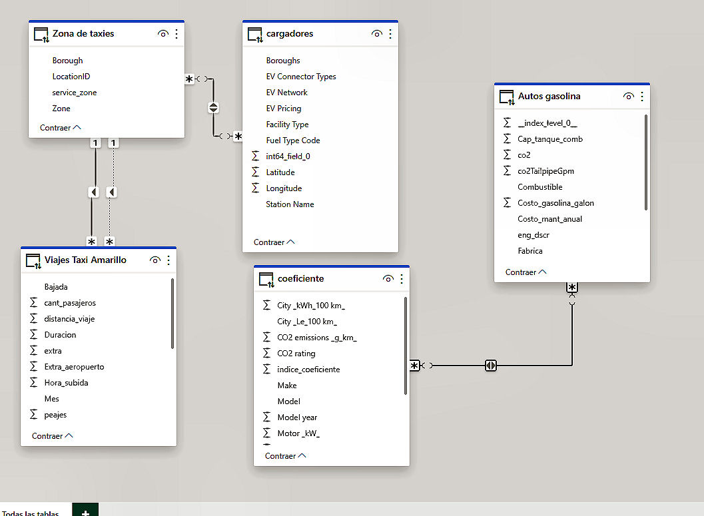

# **Análisis de Rentabilidad Económica y Sostenibilidad Ambiental en el Mercado de Transporte de Pasajeros**

<p align="center">


</p>

# **E.D.A. EcoData Analyst**
## Grupo de Trabajo

Somos **E.D.A. EcoData Analyst**, un equipo multidisciplinario formado por cinco personas de diversos países de Latinoamérica.
Nuestro grupo está compuesto por profesionales apasionados por el análisis de datos y comprometidos con la sostenibilidad ambiental. Nos unimos con el objetivo de utilizar nuestras habilidades y conocimientos en data science para generar soluciones innovadoras y sustentables que puedan contribuir a un futuro más limpio y eficiente.

## Video Introductorio

<div align="center">
  <a href="https://youtu.be/T610j0k7-BM" target="_blank">
    
  </a>
</div>

### Miembros del Equipo

**Richard Robles** - Colombia 

[](https://www.linkedin.com/in/richard-robles-7b88a978/) - Proyect manager - Data Engineering

---

**Abraham Gomez** - Mexico

[](https://www.linkedin.com/in/abraham-gomez-806934238/) - Data Scientist - Data Engineering

---

**Luis Meza** - Mexico

[](https://www.linkedin.com/in/luis-angel-meza-caballero-800636264/)- Data Analyst

---

**Martin Molina** - Argentina

[](https://www.linkedin.com/in/martin-molina-3b5131b7/) - Data Analyst

---

**Ivan Salva** - Argentina

[](https://www.linkedin.com/in/ivan-salva-57a98630/) - Data Scientist

## Nuestra Misión

En E.D.A. EcoData Analyst, creemos que el análisis de datos puede ser una herramienta poderosa para el cambio positivo. Nos dedicamos a proporcionar análisis detallados y basados en datos para abordar desafíos ambientales y económicos, ayudando a las empresas a tomar decisiones informadas y sostenibles.

## Descripción del Proyecto

Este proyecto tiene como objetivo analizar la viabilidad y sostenibilidad de una empresa de servicios de transporte de pasajeros que actualmente opera en el sector de micros, de media y larga distancia, y que está interesada en invertir en el sector de transporte de pasajeros con automóviles. Con una visión de futuro menos contaminado y alineada con las tendencias actuales del mercado, la empresa desea corroborar la relación entre estos medios de transporte y la calidad del aire, así como la contaminación sonora, para evaluar la posibilidad de implementar vehículos eléctricos en su flota, ya sea total o parcialmente.

## Objetivos

1. **Evaluar la rentabilidad** de invertir en el sector de transporte de pasajeros con automóviles.
2. **Analizar el impacto ambiental** en términos de calidad del aire y contaminación sonora.
3. **Estudiar la viabilidad de implementar vehículos eléctricos** en la flota de la empresa.

## Contexto

Para realizar un análisis preliminar y obtener un marco de referencia sólido, se decidió estudiar en la ciudad de Nueva York:

- El movimiento de los taxis en la ciudad.
- La infraestructura de cargas y reabastecimientos y su distribución
- Este estudio nos permitirá tomar decisiones bien fundamentadas sobre la inversión y la implementación de vehículos eléctricos en el sector de transporte de pasajeros con automóviles.

## Datos de estudio

El análisis se basa en un conjunto de datos de taxis de la ciudad de Nueva York, que incluye información detallada sobre viajes, como:

- Fecha y hora de inicio y fin del viaje.
- Ubicación de recogida y destino.
- Distancia y duración del viaje.
- Tarifas y métodos de pago.
- Tipos de vehículo utilizado y eficiencia energética.

## **Alcance del proyecto**
Metodología, vida y calidad de los Datos

1. **Recolección y preparación de datos**: Se recopilaron los datos de viajes de taxis de los ultimos 3 meses y se limpiaron para asegurar su calidad y consistencia. Así mismo se redujo al minimo la cantidad de datos usados pero sin perder nada de la representatividad de los mismos para generar un ahorro extra de dineroa a la empresa en calculos computacionales. Se aplicaron las mejores técnicas depuración de datos (Eliminación de Datos nulos, duplicados, outliers, erroneos, etc) a todas las fuentes de información.
2. **Análisis exploratorio de datos**: los Datos obtenidos tras la limpieza y reducción resultaron de una excelente calidad, y con esto se realizó un análisis para entender la distribución y características de los viajes, vehiculos y Viabilidad tanto Económica como Ecológica del proyecte.
3. **Modelado y análisis de rentabilidad**: Se desarrollaron modelos para evaluar la rentabilidad del transporte de pasajeros con automóviles, considerando diferentes escenarios.
4. **Análisis de impacto ambiental**: Se analizaron los datos de calidad del aire y contaminación sonora en relación con el transporte de taxis.
5. **Simulación de escenarios con vehículos eléctricos**: Se evaluó la viabilidad y beneficios de reemplazar parte o toda la flota por vehículos eléctricos.


## Descripción del Diagrama de Entidad-Relación del Proyecto de Implementación de Vehículos Eléctricos

</p>
<p align="center">


</p>

Este diagrama de entidad-relación (ERD) representa los componentes y sus interrelaciones en el análisis de la implementación de vehículos eléctricos en los cinco boroughs de Nueva York. A continuación se describen las entidades y sus relaciones:

1. **Zona de Taxis**:
   - **Atributos**: Borough, LocationID, service_zone, Zone.
   - **Relaciones**: Se conecta con "Viajes Taxi Amarillo" para identificar la ubicación de los viajes.

2. **Cargadores**:
   - **Atributos**: Boroughs, EV Connector Types, EV Network, EV Pricing, Facility Type, Latitude, Longitude, Station Name.
   - **Relaciones**: Se vincula con "Zona de taxis" para ubicar las estaciones de carga dentro de las zonas de servicio de taxis.

3. **Viajes Taxi Amarillo**:
   - **Atributos**: Bajada, cant_pasajeros, distancia_viaje, Duracion, extra, Extra_aeropuerto, Hora_subida, Mes, peajes.
   - **Relaciones**: Relacionado con "Zona de Taxis" para detallar los viajes realizados en cada zona.

4. **Coeficiente**:
   - **Atributos**: City_kWh_100km, City_Le_100km, CO2_emissions_g_km, CO2_rating, indice_coeficiente, Make, Model, Model_year, Motor_kW.
   - **Relaciones**: Vinculado a "Autos Gasolina" para comparar coeficientes de eficiencia y emisiones.

5. **Autos Gasolina**:
   - **Atributos**: Cap_tanque_comb, co2, co2TailpipeGpm, Combustible, Costo_gasolina_galon, Costo_mant_anual, eng_dscr, Fabrica.
   - **Relaciones**: Conectado con "Coeficiente" para evaluar el rendimiento y las emisiones de los autos de combustión interna en comparación con los eléctricos.

Este diagrama facilita el análisis de datos sobre la viabilidad de los vehículos eléctricos, permitiendo identificar patrones y realizar comparaciones entre diferentes tipos de vehículos y sus impactos en el entorno urbano.

## Herramientas y Tecnologías Utilizadas


**Python - Pandas y NumPy**: Para la manipulación de datos para el procesamiento y análisis de datos.


**SQL** para generar las bases de datos.


Google cloud para almacenar las bases de datos


**Power BI**: Para la creación de informes interactivos y visualización avanzada de resultados.

## KEY PERFORMANCE INDICATOR KPI:

Se analiza mediante los KPI de los datos actuales de los vehiculos de taxis y la contaminación de Nueva York, para entender el desarrollo de la movilidad en vehiculos particulares.

| KPI                                                                                                                                                         | Calculo                                                                        | Objetivo                     | Periodo |
| ----------------------------------------------------------------------------------------------------------------------------------------------------------- | ------------------------------------------------------------------------------ | ---------------------------- | ------- |
| Reducción del 3% la huella de carbono mensual dada una inversión inicial de Capital para reemplazo parcial o total de la flota de Vehículos de la compañía. | Suma de beneficios fiscales y de performance sobre Costo de inversion vehículo | Mejorar KPI del mes anterior | Mensual |
| Aumentar mensualmente 4% los ingresos por concepto de viajes.                                                                                              | Suma de ingresos cobrados por viajes totales                                   | Mejorar KPI del mes anterior | Mensual |
| Tasa de retorno de inversión anualizado por el reemplazo total o parcial de la flota de taxis                                                               | Margen de utilidad por vehículo sobre costo de adquisición                     | Mejorar KPI del año anterior | Anual   |
| Mejorar en 5% la utilidad por unidad                                                                                                                       | Margen de utilidad unitario actual sobre periodo anterior                      | Mejorar KPI del mes anterior | Mensual |

## Arquitectura de la aplicación

Acá encontramos una descripción de la arquitectura de la aplicación.


Estos pasos te permitirán configurar y desplegar un entorno de Cloud Composer en Google Cloud utilizando Google Cloud Shell, siguiendo las mejores prácticas de seguridad y compatibilidad.

Este diagrama ilustra el flujo de datos desde la recopilación hasta la visualización en Power BI para el proyecto de implementación de vehículos eléctricos en los cinco boroughs de Nueva York. A continuación se describe el proceso:

1. **Almacenamiento de Datos**:
   - **Fuentes**: Los datos se recopilan en formatos CSV y Parquet.
   - **Cloud Storage**: Los archivos de datos se almacenan en la nube, permitiendo un acceso centralizado y seguro.

2. **ETL (Extracción, Transformación y Carga)**:
   - **Python y Cloud Composer**: Se utilizan scripts de Python y Cloud Composer para realizar la extracción, transformación y carga de datos. Este proceso asegura que los datos sean limpiados y estructurados adecuadamente para el análisis.

3. **Almacenamiento de Datos Transformados**:
   - **BigQuery**: Los datos transformados se cargan en BigQuery, una plataforma de almacenamiento y análisis de datos escalable y de alto rendimiento.

4. **Modelo de Machine Learning**:

   - **Probabilidad y estadistica**:  Los datos de los datasets se utilizan para determinar el comportamiento de los taxis en la ciudad de Nueva York. Se emplean métodos estadísticos y probabilísticos para describir cómo interactúan los taxis con NYC. Por ejemplo, se utilizan distribuciones de frecuencias para determinar las rutas que comúnmente solicitaría un usuario. Además, la demanda y los tiempos de espera se pueden determinar mediante el método M/M/1 de teoría de colas.
   - **Método Montecarlo**:  Es una técnica numérica que nos ayuda a entender cómo se comportan sistemas complejos, como los taxis en Nueva York. Imagina que estamos simulando muchos viajes de taxis durante un período de tiempo. Cada vez que ejecutamos la simulación, obtenemos valores diferentes para cosas como la tarifa promedio o el tiempo de viaje. Pero a medida que repetimos la simulación muchas veces (digamos n veces), esos valores promedio comienzan a converger hacia un valor estable. Además, la desviación estándar (una medida de cuánto varían los valores) disminuye. Así que, al final, tenemos una buena idea de cómo se comportan los taxis en promedio. ¡Es como mirar un montón de trayectorias de taxis imaginarios para entender mejor la realidad!
   - **Entrenamiento y Predicción**: Los datos en BigQuery se utilizan para entrenar un modelo de Machine Learning que genera predicciones y análisis avanzados.   
   - **Streamlit**: Es una herramienta que permite crear interfaces de usuario interactivas para visualizar datos y modelos de Machine Learning. En nuestro caso, hemos integrado nuestro modelo de ML con una interfaz desarrollada en Streamlit. Esta interfaz es fácil de usar y está diseñada para los usuarios finales. 
   
   En la primera versión de nuestro modelo de ML, el usuario debe ingresar el modelo de automóvil. Luego, se simulan 1000 escenarios diversos en los que el vehículo presta sus servicios. Como resultado, obtenemos información valiosa:

   - **Distancia recorrida durante un día**: Calculamos cuánto viaja el automóvil en un día.
   - **Distancia promedio por viaje**: Determinamos la longitud típica de los viajes.
   - **Ingreso diario**: Estimamos los ingresos totales por día.
   - **Ingreso promedio por viaje**: Calculamos cuánto gana el conductor en promedio por cada viaje.
   - **Utilidad después de mantenimientos y consumo de combustible/eléctrico**: Analizamos las ganancias netas después de considerar los costos de mantenimiento y el consumo de combustible o electricidad.
   - **Emisiones totales de CO2**: Evaluamos el impacto ambiental.
   - **Emisión promedio por servicio**: Calculamos las emisiones de CO2 por cada viaje.
   - **Tabla con estadísticas generales**: Proporcionamos información relevante, como los tiempos muertos (espera) y el tiempo promedio por viaje.
   
   Si deseas probar nuestro modelo, puedes acceder a él a través de este [enlace](https://montecarlonyc.streamlit.app/#ingreso-por-viaje) o ingresando directamente en la URL: https://montecarlonyc.streamlit.app/#ingreso-por-viaje.

5. **Visualización y Análisis**:
   - **Power BI**: Los datos y resultados del modelo de ML se visualizan en Power BI, permitiendo un análisis detallado y la generación de informes interactivos para la toma de decisiones.

Este flujo de datos asegura una gestión eficiente y un análisis profundo de la viabilidad y sostenibilidad de la implementación de vehículos eléctricos en la flota de transporte de Nueva York.

#### ETL Pipeline

Structure

- `Data/`: Directory containing the data files.
- `dags/`: Directory containing the Airflow DAG for the ETL pipeline.
- `scripts/`: Directory containing the Python scripts for uploading files to GCS and loading them into BigQuery.
- `config/`: Directory containing configuration files.

Para ejecutar el pipeline ejecute los siguientes pasos:

1. Se crear el entorno virtual con el cual se ejecute el pipeline.

   ```bash
   python -m venv .venv
   ```
2. Se activa el entorno virtual

   ```powershell
   source .venv/bin/activate
   ```
3. Se instalan las dependencias

   ```powershell
   pip install -r requirements.txt
   ```
4. Se crean los buckets y las carpetas correspondientes en google cloud storage

   ```powershell
   # Crear un bucket
   gsutil mb gs://nombre-del-bucket

   # Crear una carpeta dentro del bucket
   gsutil mkdir gs://nombre-del-bucket/nombre-de-la-carpeta
   ```
5. Se ejecuta el script python `upload_to_gcs.py`

6. Para crear un entorno de Google Composer usando la línea de comandos de Google Cloud Shell, sigue estos pasos:

###### Paso 1: Configurar el Proyecto

1. Abre Google Cloud Shell desde la consola de Google Cloud.
2. Configura el proyecto en el que deseas trabajar:
   ```sh
   gcloud config set project [PROJECT_ID]
   ```

###### Paso 2: Crear el Entorno de Cloud Composer

1. Ejecuta el siguiente comando para crear un entorno de Cloud Composer. Reemplaza `[ENVIRONMENT_NAME]` con el nombre deseado para tu entorno y `[LOCATION]` con la región donde deseas crear el entorno (por ejemplo, `us-central1`):
   ```sh
   gcloud composer environments create [ENVIRONMENT_NAME] --location [LOCATION]
   ```

###### Paso 3: Configurar Variables de Entorno

1. Establece las variables de entorno necesarias para tu entorno de Airflow en Cloud Composer:
   ```sh
   gcloud composer environments run [ENVIRONMENT_NAME] --location [LOCATION] variables -- set gcp_project [PROJECT_ID]
   gcloud composer environments run [ENVIRONMENT_NAME] --location [LOCATION] variables -- set gcs_bucket gs://[YOUR_BUCKET_NAME]
   gcloud composer environments run [ENVIRONMENT_NAME] --location [LOCATION] variables -- set gce_zone [YOUR_ZONE]
   ```

###### Paso 4: Subir Archivos a Cloud Storage

1. Sube tus archivos DAG a la carpeta correspondiente en el bucket de Cloud Storage que se creó para tu entorno de Composer:
   ```sh
   gsutil cp path/to/your_dag.py gs://[YOUR_BUCKET_NAME]/dags/

## Resultados

Los resultados del análisis proporcionarán información valiosa sobre:

- La rentabilidad esperada de invertir en el sector de transporte de pasajeros con automóviles.
- El impacto potencial en la calidad del aire y la contaminación sonora.
- La viabilidad de implementar vehículos eléctricos en la flota, incluyendo beneficios tanto ecológicos, económicos y sociales, y los desafíos asociados a ser pioneros del cambio.

## Conclusiones y Recomendaciones

Para el análisis de la viabilidad y sostenibilidad de una empresa de servicios de transporte de pasajeros en Nueva York, hemos evaluado distintos aspectos relacionados con la implementación de vehículos eléctricos en su flota. A continuación, presentamos las principales conclusiones basadas en los datos analizados:

1. **Impacto Ambiental Positivo**:	
   - **Reducción de Emisiones**: Los vehículos eléctricos (VE) presentan una considerable reducción en las emisiones de gases contaminantes en comparación con los vehículos de combustión interna. Esto contribuye significativamente a mejorar la calidad del aire, especialmente en áreas urbanas densamente pobladas como Manhattan.
   - **Disminución de la Contaminación Sonora**: Los VE son mucho más silenciosos, lo que reduce la contaminación sonora en las ciudades, mejorando la calidad de vida de los residentes.

2. **Viabilidad Económica**:
   - **Costos Operativos Reducidos**: Los vehículos eléctricos resultan ser mucho más económicos de operar. Los costos de mantenimiento y de energía (electricidad) son inferiores a los de los vehículos de combustión interna, lo cual se traduce en ahorro a largo plazo para la empresa.
   - **Infraestructura de Carga Adecuada**: La infraestructura de cargadores para vehículos eléctricos en Nueva York, especialmente en Manhattan y sus alrededores, es robusta y en crecimiento, lo que facilita la operación eficiente de una flota de VE.

3. **Modelos Recomendados para la Inversión**:
   - **Tesla Model Y**: Destacado por su autonomía, eficiencia y amplia red de supercargadores, el Tesla "Model Y" se presenta como una opción altamente viable para la flota de vehículos eléctricos de la empresa.
   - **IONIQ 6 Long Range**: Este modelo es reconocido por su excelente rendimiento en términos de autonomía y economía, posicionándose como otra opción recomendada para la inversión.

En resumen, la implementación de vehículos eléctricos en la flota de la empresa no solo es viable y sostenible, sino que también ofrece beneficios económicos y ambientales. Estos factores alinean a la empresa con las tendencias actuales del mercado hacia un futuro menos contaminado y más eficiente en términos energéticos.

## Contacto

Para más información o consultas, puedes contactarme a través de ***Eco.Data.Analyst@gmail.com***
